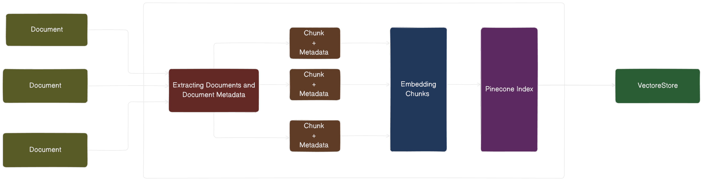

<h1 align="center">DocIndex: Fast Persistent Document Embeddings Storage for Production-Level RAG</h1>
<p align="center">

  <a href="https://github.com/KevKibe/docindex/commits/">
    
  </a>
  <a href="https://github.com/KevKibe/docindex/blob/master/LICENSE">
    
  </a>
<br>



 *Efficiently store multiple document embeddings and their metadata, whether they're offline or online, in a persistent Pinecone Vector Database optimized for production-level Retrieval Augmented Generation (RAG) applications fast*
## Features

- ⚡️ **Rapid Indexing**: Quickly index multiple documents along with their metadata, including source, page details, and content, into Pinecone DB.<br>
- 📚 **Document Flexibility**: Index documents from your local storage or online sources with ease.<br>
- 📂 **Format Support**: Store various document formats, including PDF, docx(in-development), etc.<br>
- 🔁 **LLM Providers Integration**: Enjoy support for multiple LLM providers such as OpenAI, Google Generative AI, Cohere and more in development.<br>
- 🛠️ **Configurable Vectorstore**: Configure a vectorstore directly from the index to facilitate RAG pipelines effortlessly.
- 🔍 **Initialize a RAG Retriever**: Spin up a RAG retriever using your vectorstore.
  
## Setup

```python
pip install docindex
```

## Getting Started
- Sign up to [Pinecone](https://www.pinecone.io/) and get an API key.
### Import Dependencies
```python
# Import the appropriate indexer class based on the language model you want to use
from _openai.doc_index import OpenaiPineconeIndexer  # Using OpenAI
from _google.doc_index import GooglePineconeIndexer  # Using GoogleGenerativeAI
from _cohere.doc_index import CoherePineconeIndexer  # Using Cohere
```

### API Keys and Configuration
```python
# Replace these values with your actual API keys and index name or have them in a variable environment/secret key.
pinecone_api_key = "your_pinecone_api_key"  # Your Pinecone API key
index_name = "your_index_name"  # Your Pinecone index name

openai_api_key = "your_openai_api_key"     # Using OpenAI)
# google_api_key = "your_google_api_key"   # Using GoogleGenerativeAI
#cohere_api_key = "your_cohere_api_key"    # Using Cohere

# Configure batch limit and chunk size
batch_limit = "batch-limit" # Maximum batch size for upserting documents -> Optional: Default 32
chunk_size = "chunk-size"  # Size of texts per chunk -> Optional: Default 256
```

### List of Documents:
```python
# List of URLs of the documents to be indexed. (offline on your computer or online)
urls = [
 "your-document-1.pdf",
 "your-document-2.md",
 "your-document-3.html",
 "your-document-4.docx",
]
```
### Index, Store Documents and Initialize VectorStore
```python
# Initialize the Pinecone indexer with the desired model

pinecone_indexer = OpenaiPineconeIndexer(index_name, pinecone_api_key, openai_api_key)    # Using OpenAI
# pinecone_indexer = GooglePineconeIndexer(index_name, pinecone_api_key, google_api_key)  # Using GoogleGenerativeAI
# pinecone_indexer = CoherePineconeIndexer(index_name, pinecone_api_key, cohere_api_key)  # Using Cohere


# To create a new Index
pinecone_indexer.create_index()

# Store the document embeddings with the specified URLs and batch limit
pinecone_indexer.index_documents(urls,batch_limit,chunk_size)

# Initialize the Vectorstore
vectorstore = pinecone_indexer.initialize_vectorstore(index_name)
```
### Query and Retrieve Information
```python
query = "what is the transformers architecture"
response = pinecone_indexer.retrieve_and_generate(
                    vector_store = vectorstore, 
                    query = query, 
                    top_k = "number of sources to retrieve",    # Default is 3
                    pydantic_parser=True                        # Whether to use Pydantic parsing for the generated response (default is True)
                    rerank_model = "reranking model"            # Default is 'flashrank'  Other models available Docs:https://github.com/AnswerDotAI/rerankers
                    )
response
```

### Response
```bash
query='what is the transformers architecture' result='The Transformer follows this overall architecture using stacked self-attention and point-wise, fully-connected layers for both the encoder and decoder, shown in the left and right halves of Figure 1, respectively.' page=1 source_documents=[Document(page_content='Figure 1: The Transformer - model architecture.\nThe Transformer follows this overall architecture using stacked self-attention and point-wise, fully\nconnected layers for both the encoder and decoder, shown in the left and right halves of Figure 1,\nrespectively.\n3.1 Encoder and Decoder Stacks\nEncoder: The encoder is composed of a stack of N= 6 identical layers. Each layer has two\nsub-layers. The first is a multi-head self-attention mechanism, and the second is a simple, position-\nwise fully connected feed-forward network. We employ a residual connection [ 11] around each of\nthe two sub-layers, followed by layer normalization [ 1]. That is, the output of each sub-layer is\nLayerNorm( x+ Sublayer( x)), where Sublayer( x)is the function implemented by the sub-layer\nitself. To facilitate these residual connections, all sub-layers in the model, as well as the embedding\nlayers, produce outputs of dimension dmodel = 512 .\nDecoder: The decoder is also composed of a stack of N= 6identical layers. In addition to the two', source=2.0, title='https://arxiv.org/pdf/1706.03762.pdf')]

```

### Query Response Attributes:
```python
response.query                 # The query that was submitted
response.result                # The result of the query, including any retrieved information.
response.source_documents      # A list of source documents related to the query.
response.sources               # A list of the sources (page numbers) from the source documents.
response.titles                # A list of the titles from the source documents.
response.page_contents         # A list of the page contents from the source documents.
```

### Delete Index: 
```python
# To delete the created Index
pinecone_indexer.delete_index()
```

## Using the CLI

- Clone the Repository: Clone or download the application code to your local machine.
```bash
git clone https://github.com/KevKibe/docindex.git
```

- Create a virtual environment for the project and activate it.
```bash
# Navigate to project repository
cd docindex

# create virtual environment
python -m venv venv

# activate virtual environment
source venv/bin/activate
```
- Install dependencies by running this command
```bash
pip install -r requirements.txt
```

- Navigate to src 
```bash
cd src
```
- To create an index

```bash
# Using OpenAI 
python -m  utils.create_index --pinecone_api_key "your_pinecone_api_key" --index_name "your_index_name" 

```

- Run the command to start indexing the documents

```bash
# Using OpenAI

python -m _openai.index_documents  --pinecone_api_key "your_pinecone_api_key" --index_name "your_index_name" --openai_api_key "your_openai_api_key" --batch_limit "batch-limit" --docs  "doc-1.pdf" "doc-2.pdf' --chunk_size "chunk-size"

# Using Google Generative AI

python -m _google.index_documents  --pinecone_api_key "your_pinecone_api_key" --index_name "your_index_name" --google_api_key "your_google_api_key" --batch_limit "batch-limit" --docs  "doc-1.pdf" "doc-2.pdf' --chunk_size "chunk-size"

Using Cohere

python -m _cohere.index_documents   --pinecone_api_key "your_pinecone_api_key" --index_name "your_index_name" --cohere_api_key "your_google_api_key" --batch_limit "batch-limit" --docs  "doc-1.pdf" "doc-2.pdf' --chunk_size "chunk-size"

```
- To delete an index

```bash
# Using OpenAI 
python -m  utils.delete_index --pinecone_api_key "your_pinecone_api_key" --index_name "your_index_name" 

```

## Contributing 
🌟 First consider giving it a star at the top right. It means a lot!
Contributions are welcome and encouraged.
Before contributing, please take a moment to review our [Contribution Guidelines](https://github.com/KevKibe/docindex/blob/master/DOCS/CONTRIBUTING.md) for important information on how to contribute to this project.

If you're unsure about anything or need assistance, don't hesitate to reach out to us or open an issue to discuss your ideas.

We look forward to your contributions!

## License
This project is licensed under the MIT License - see the [LICENSE](https://github.com/KevKibe/docindex/blob/master/LICENSE) file for details.

## Contact
For any enquiries, please reach out to me through keviinkibe@gmail.com
